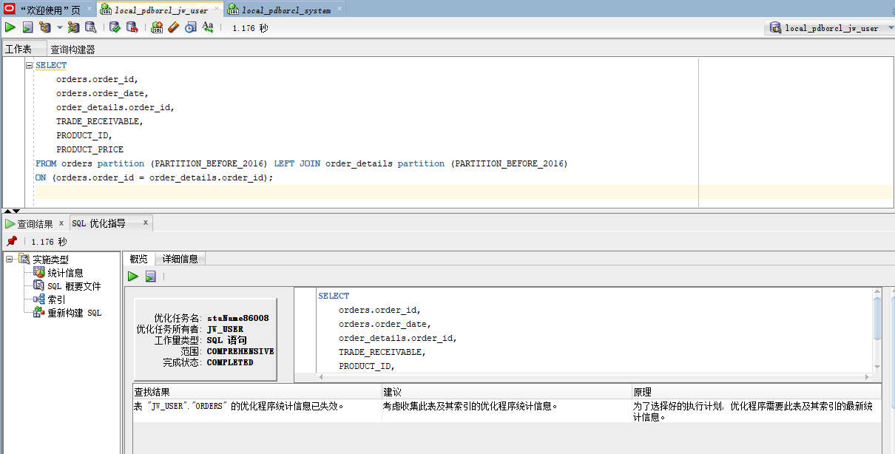

# 实验三：创建分区表
---
## 实验目的：

掌握分区表的创建方法，掌握各种分区方式的使用场景

## 实验内容：

- 本实验使用3个表空间：USERS,USERS02,USERS03。在表空间中创建两张表：订单表(orders)与订单详表(order_details)
- 使用你自己的账号创建本实验的表，表创建在上述3个分区，自定义分区策略。
- 使用system用户给你自己的账号分配上述分区的使用权限。使用system用户给自己的用户分配可以查询执行计划的权限
- 表创建成功后，插入数据，数据能并平均分布到各个分区。每个表的数据都应该大于1万行，对表进行联合查询
- 写出插入数据的语句和查询数据的语句，并分析语句的执行计划
- 进行分区与不分区的对比实验

## 实验步骤：

1.给自己的用户分配3个表空间，USERS,USERS02,USERS03。老师已经给我们分配了，所以此处略去分配表空间的过程。

2.使用system用户给自己的账号分配分区USERS,USERS02,USERS03的使用权限。
sql语句为：

```
ALTER USER jw_user QUOTA 50M ON USERS20;
ALTER USER jw_user QUOTA 50M ON USERS20;
```


3. 在表空间中创建两张表：订单表(orders)与订单详表(order_details)

3.1 创建订单表orders，按订单日期分区：
(采用范围分区：将数据根据范围映射到每一个分区，范围是在创建分区时由指定的分区键决定的，分区键经常采用日期)
将2016以前的数据放在users表空间中
2016的数据放在users02表空间中
2016以后的数据放在users03表空间中

```
CREATE TABLE ORDERS
(
order_id NUMBER(10,0)NOT NULL,
customer_name VARCHAR2(40 BYTE)NOT NULL,
customer_tel VARCHAR2(40 BYTE)NOT NULL,
order_date DATE NOT NULL,
employee_id NUMBER(6,0) NOT NULL,
discount NUMBER(8,2)DEFAULT 0,
trade_receivable NUMBER(8,2)DEFAULT 0
)
TABLESPACE USERS
PCTFREE 10
INITRANS 1
STORAGE
(
BUFFER_POOL DEFAULT
)
PARTITION BY RANGE (order_date)  //RANGE分区类型
(
PARTITION partition_before_2016 VALUES LESS THAN (
TO_DATE(' 2016-01-01 00: 00: 00', 'SYYYY-MM-DD HH24: MI: SS',
'NLS_CALENDAR=GREGORIAN'))TABLESPACE USERS,

PARTITION partition_before_2017 VALUES LESS THAN (
TO_DATE(' 2017-01-01 00: 00: 00', 'SYYYY-MM-DD HH24: MI: SS',
'NLS_CALENDAR=GREGORIAN'))TABLESPACE USERS02,

PARTITION partition_before_2018 VALUES LESS THAN (
TO_DATE(' 2018-01-01 00: 00: 00', 'SYYYY-MM-DD HH24: MI: SS',
'NLS_CALENDAR=GREGORIAN'))TABLESPACE USERS03
);

```


表结果：


查询表的分区sql：

```
select partition_name,high_value from user_tab_partitions t where table_name='ORDERS';
```
order分区情况：


3.2 创建从表订单详表(order_details)：
订单表和订单详情表之间建立引用分区，通过order_id 建立主外键关联。
引用分区：
引用分区是针对主外键关联建立的分区，主表分区之后，借助引用分区可以实现按照主表分区的方式对从表进行分区，这样从表就会继承主表的分区机制。

添加主键约束：

```
alter table orders add constraint order_details_fk1 primary key (order_id);
```


创建从表订单详表(order_details)：

```
CREATE TABLE order_details 
(
id NUMBER(10, 0) NOT NULL 
, order_id NUMBER(10, 0) NOT NULL
, product_id VARCHAR2(40 BYTE) NOT NULL 
, product_num NUMBER(8, 2) NOT NULL 
, product_price NUMBER(8, 2) NOT NULL 
, CONSTRAINT order_details_fk1 FOREIGN KEY  (order_id)REFERENCES orders  (  order_id   )
ENABLE 
) 
TABLESPACE USERS 
PCTFREE 10 INITRANS 1 
STORAGE (   BUFFER_POOL DEFAULT ) 
NOCOMPRESS NOPARALLEL
PARTITION BY REFERENCE (order_details_fk1)
(-- PARTITION 2016
PARTITION PARTITION_BEFORE_2016 
NOLOGGING 
TABLESPACE USERS --必须指定表空间,否则会将分区存储在用户的默认表空间中
PCTFREE 10
INITRANS 1
STORAGE
(
INITIAL 8388608
NEXT 1048576
MINEXTENTS 1
MAXEXTENTS UNLIMITED
BUFFER_POOL DEFAULT
) 
NOCOMPRESS NO INMEMORY,-- PARTITION 2017 
PARTITION PARTITION_BEFORE_2017 
NOLOGGING 
TABLESPACE USERS02
PCTFREE 10
INITRANS 1
STORAGE
(
INITIAL 8388608
NEXT 1048576
MINEXTENTS 1
MAXEXTENTS UNLIMITED
BUFFER_POOL DEFAULT
) 
NOCOMPRESS NO INMEMORY,-- PARTITION 2018
PARTITION PARTITION_BEFORE_2018 
NOLOGGING 
TABLESPACE USERS03
PCTFREE 10
INITRANS 1
STORAGE
(
INITIAL 8388608
NEXT 1048576
MINEXTENTS 1
MAXEXTENTS UNLIMITED
BUFFER_POOL DEFAULT
) 
NOCOMPRESS NO INMEMORY  
);

```
建立过程：


表结果：


分区情况：


4.插入数据，数据能并平均分布到各个分区。每个表的数据都应该大于1万行，对表进行联合查询

插入数据sql：

```
begin
for i in 1..4000
loop   
insert into orders(ORDER_ID ,customer_name, customer_tel, order_date, employee_id, trade_receivable, discount) VALUES(i,'jiangwen', '15982558184', to_date ( '2015-5-21 10:31:32' , 'YYYY-MM-DD HH24:MI:SS' ), 007, 16, 7);
insert into orders(ORDER_ID ,customer_name, customer_tel, order_date, employee_id, trade_receivable, discount) VALUES(i,'jiangwen', '15982558184', to_date ( '2016-5-21 10:31:32' , 'YYYY-MM-DD HH24:MI:SS' ), 007, 16, 7);
insert into orders(ORDER_ID ,customer_name, customer_tel, order_date, employee_id, trade_receivable, discount) VALUES(i,'jiangwen', '15982558184', to_date ( '2017-5-21 10:31:32' , 'YYYY-MM-DD HH24:MI:SS' ), 007, 16, 7);

end loop;
    commit;
end;
/

```
2015年的数据在users区，2016年的数据在users02区，2017年的数据在users03区

实例2015年的数据结果：


联合查询：


联合查询计划：


联合查询优化指导：




4.使用system用户给自己的用户分配可以查询执行计划的权限

```
grant select on v$sesstat to con_jw_view ;
grant SELECT_CATALOG_ROLE to jw_user;
grant SELECT ANY DICTIONARY to jw_user;
grant select on v_$sesstat to jw_user;
```


不分区查询语句：

```
set autotrace on;
select * from orders, order_details where orders.order_id = order_details.order_id(+);
```
执行计划：


5. 不分区和分区的对比实验：

分区的优点：

- 增强可用性，如果表的某个分区出现故障，表在其他分区的数据仍然可用。
- 维护方便，如果表达某个分区出现故障，需要修复数据，修复该分区即可
- 均衡I/O,可以把不同分区映射到磁盘,平行改善整个系统性能
- 改善查询性能,对象的查询可以只搜索自己关心的分区，提高检索速度


