# 实验4：对象管理

## 实验目的：
了解Oracle表和视图的概念，学习使用SQL语句Create Table创建表，学习Select语句插入，修改，删除以及查询数据，学习使用SQL语句创建视图，学习部分存储过程和触发器的使用。
##  实验场景：
假设有一个生产某个产品的单位，单位接受网上订单进行产品的销售。通过实验模拟这个单位的部分信息：员工表，部门表，订单表，订单详单表。

## 实验内容要求：
### 录入数据：
要求至少有1万个订单，每个订单至少有4个详单。至少有两个部门，每个部门至少有1个员工，其中只有一个人没有领导，一个领导至少有一个下属，并且它的下属是另一个人的领导（比如A领导B，B领导C）。

###  序列的应用
插入ORDERS和ORDER_DETAILS 两个表的数据时，主键ORDERS.ORDER_ID, ORDER_DETAILS.ID的值必须通过序列SEQ_ORDER_ID和SEQ_ORDER_ID取得，不能手工输入一个数字。

###  触发器的应用：
维护ORDER_DETAILS的数据时（insert,delete,update）要同步更新ORDERS表订单应收货款ORDERS.Trade_Receivable的值。

```
--创建3个触发器
--------------------------------------------------------
--  DDL for Trigger ORDERS_TRIG_ROW_LEVEL
--------------------------------------------------------
CREATE OR REPLACE EDITIONABLE TRIGGER "ORDERS_TRIG_ROW_LEVEL"
BEFORE INSERT OR UPDATE OF DISCOUNT ON "ORDERS"
FOR EACH ROW --行级触发器
declare
  m number(8,2);
BEGIN
  if inserting then
       :new.TRADE_RECEIVABLE := - :new.discount;
  else
      select sum(PRODUCT_NUM*PRODUCT_PRICE) into m from ORDER_DETAILS where ORDER_ID=:old.ORDER_ID;
      if m is null then
        m:=0;
      end if;
      :new.TRADE_RECEIVABLE := m - :new.discount;
  end if;
END;
/
```

## 实验运行脚本：

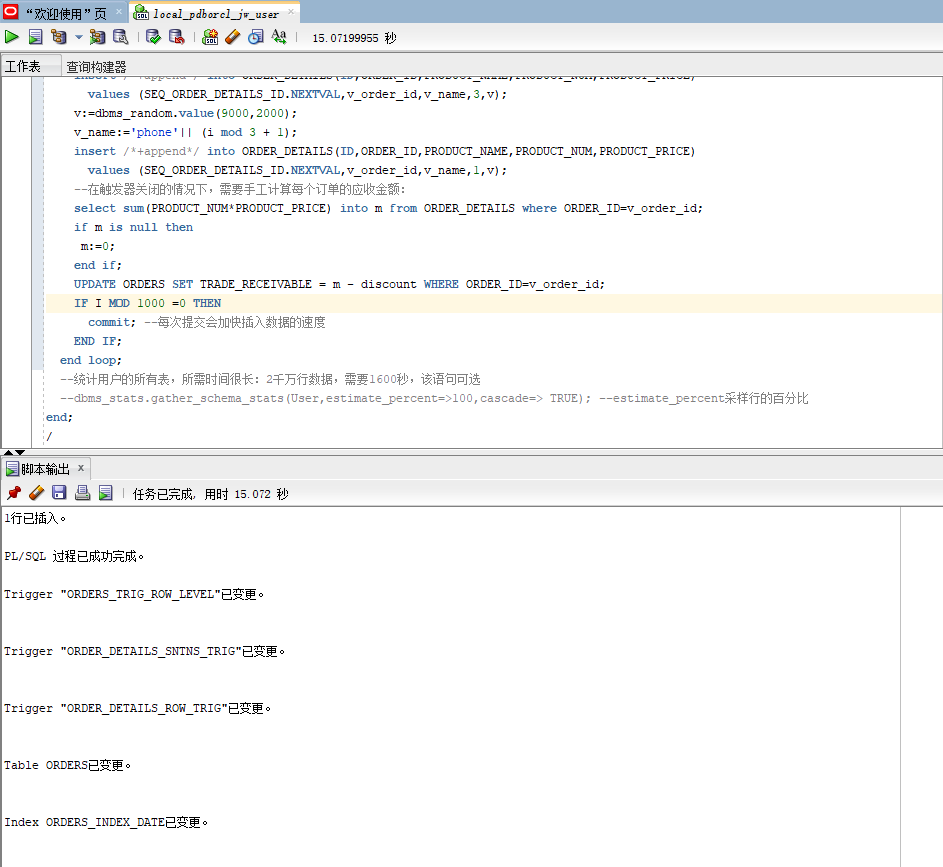

###  查询数据操作：

- 查询某个员工的信息

```
SELECT * from employees where employee_id=111;
```

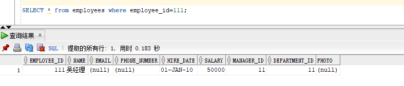

- 递归查询某个员工及其所有下属，子下属员工。

```
WITH A (EMPLOYEE_ID,NAME,EMAIL,PHONE_NUMBER,HIRE_DATE,SALARY,MANAGER_ID,DEPARTMENT_ID) AS
  (SELECT EMPLOYEE_ID,NAME,EMAIL,PHONE_NUMBER,HIRE_DATE,SALARY,MANAGER_ID,DEPARTMENT_ID
    FROM employees WHERE employee_ID = 11
    UNION ALL
  SELECT B.EMPLOYEE_ID,B.NAME,B.EMAIL,B.PHONE_NUMBER,B.HIRE_DATE,B.SALARY,B.MANAGER_ID,B.DEPARTMENT_ID
    FROM A, employees B WHERE A.EMPLOYEE_ID = B.MANAGER_ID)
SELECT * FROM A;
```

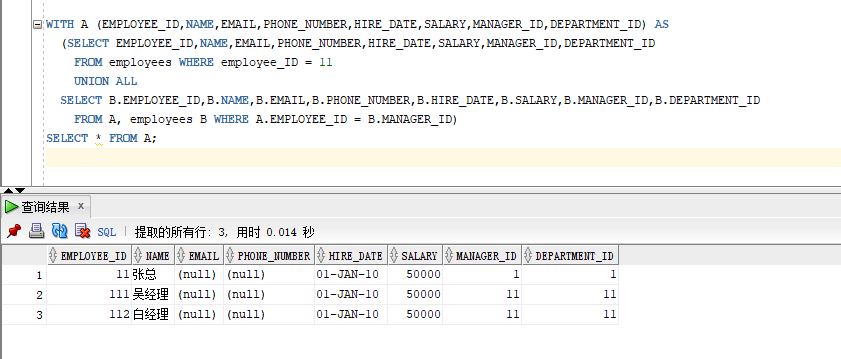

- 查询订单表，并且包括订单的订单应收货款: Trade_Receivable= sum(订单详单表.ProductNum*订单详单表.ProductPrice)- Discount。

```
select * from orders 
```
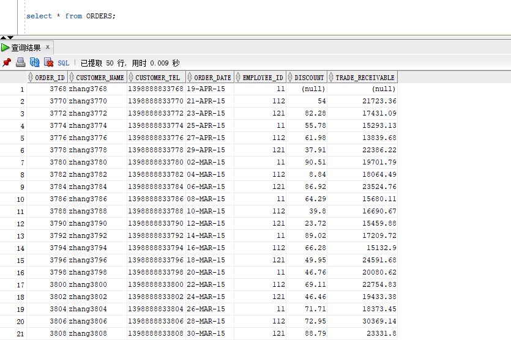

#### 15号订单详情：

```
select * from order_details where order_id=15;
```

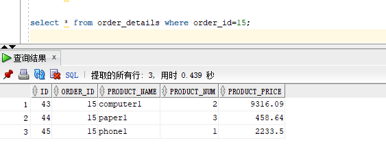

#### 15号应收付订单款：

```
select * from orders where order_id=15;
```
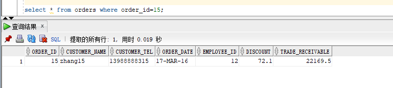

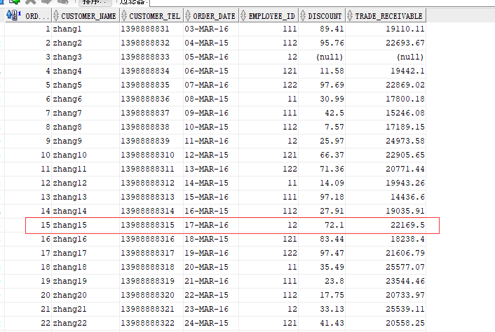

- 查询订单详表，要求显示订单的客户名称和客户电话，产品类型用汉字描述。

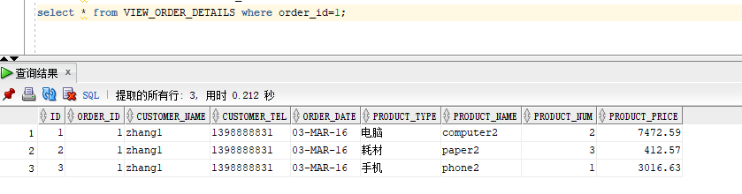

- 查询出所有空订单，即没有订单详单的订单。

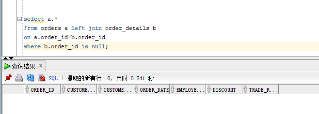

- 查询部门表，同时显示部门的负责人姓名。

```
select a.*,b.name as "负责人"
from departments a,employees b
where a.department_id=b.department_id; 
```
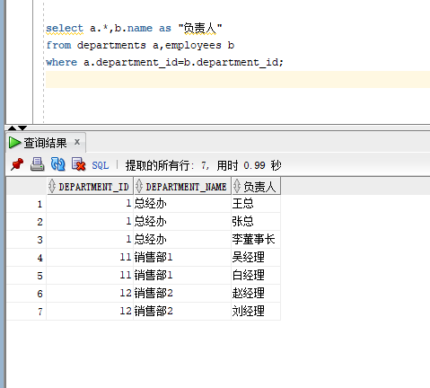

- 查询部门表，统计每个部门的销售总金额。

```
select a.department_name,
    (select sum(c.Trade_Receivable)
     from orders c 
     where c.employee_id=d.employee_id group by c.employee_id)as "销售总额"
from departments a,employees b,orders d
where a.department_id=b.department_id
and d.employee_id=b.employee_id;

```

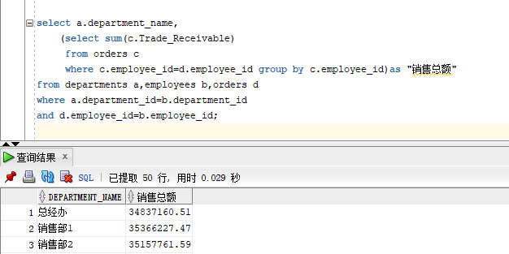

## 表结构

- 部门表DEPARTMENTS,表空间：USERS

|编号|字段名|数据类型|可以为空|注释|
|---|---|---|---|---|
|1|DEPARTMENT_ID|NUMBER(6,0)|NO|部门ID，主键|
|2|DEPARTMENT_NAME|VARCHAR2(40 BYTE)|NO|部门名称，非空|

- 产品表PRODUCTS,表空间：USERS

|编号|字段名|数据类型|可以为空|注释|
|---|---|---|---|---|
|1|PRODUCT_NAME|VARCHAR2(40 BYTE)|NO|产品名称，产品表的主键|
|2|PRODUCT_TYPE|VARCHAR2(40 BYTE)|NO|产品类型，只能取值：耗材,手机,电脑|


- 员工表EMPLOYEES,表空间：USERS

|编号|字段名|数据类型|可以为空|注释|
|---|---|---|---|---|
|1|EMPLOYEE_ID|NUMBER(6,0)|NO|员工ID，员工表的主键。|
|2|NAME|VARCHAR2(40 BYTE)|NO|员工姓名，不能为空，创建不唯一B树索引。|
|3|EMAIL|VARCHAR2(40 BYTE)|YES|电子信箱|
|4|PHONE_NUMBER|VARCHAR2(40 BYTE)|YES|电话|
|5|HIRE_DATE|DATE|NO|雇佣日期|
|6|SALARY|NUMBER(8,2)|YES|月薪，必须>0|
|7|MANAGER_ID|NUMBER(6,0)|YES|员工的上司，是员工表EMPOLYEE_ID的外键，MANAGER_ID不能等于EMPLOYEE_ID,即员工的领导不能是自己。主键删除时MANAGER_ID设置为空值。|
|8|DEPARTMENT_ID|NUMBER(6,0)|YES|员工所在部门，是部门表DEPARTMENTS的外键|
|9|PHOTO|BLOB|YES|员工照片

- 订单表ORDERS, 表空间：分区表：USERS,USERS02

|编号|字段名|数据类型|可以为空|注释|
|---|---|---|---|---|
|1|ORDER_ID|NUMBER(10,0)|NO|订单编号，主键，值来自于序列：SEQ_ORDER_ID|
|2|CUSTOMER_NAME|VARCHAR2(40 BYTE)|NO|客户名称，B树索引|
|3|CUSTOMER_TEL|VARCHAR2(40 BYTE)|NO|客户电话|
|4|ORDER_DATE|DATE|NO|订单日期，根据该属性分区存储：2015年及以前的数据存储在USERS表空间，2016年及以后的数据存储在USERS02表空间中。|
|5|EMPLOYEE_ID|NUMBER(6,0)|NO|订单经手人，员工表EMPLOYEES的外键|
|6|DISCOUNT|Number(8,2)|YES|订单整体优惠金额。默认值为0|
|7|TRADE_RECEIVABLE|Number(8,2)|YES|订单应收货款，默认为0，Trade_Receivable= sum(订单详单表.Product_Num*订单详单表.Product_Price)- Discount|

- 订单详单表ORDER_DETAILS, 表空间：分区表：USERS,USERS02，分区参照ORDERS表。

|编号|字段名|数据类型|可以为空|注释|
|---|---|---|---|---|
|1|ID|NUMBER(10,0)|NO|本表的主键，值来自于序列：SEQ_ORDER_DETAILS_ID|
|2|ORDER_ID|NUMBER(10,0)|NO|所属的订单号，订单表ORDERS的外键|
|4|PRODUCT_NAME|VARCHAR2(40 BYTE)|NO|产品名称, 是产品表PRODUCTS的外键|
|5|PRODUCT_NUM|NUMBER(8,2)|NO|产品销售数量，必须>0|
|6|PRODUCT_PRICE|NUMBER(8,2)|NO|产品销售价格|


